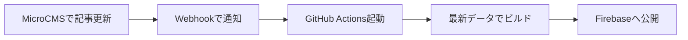

# MicroCMS 自動更新の仕組み

このプロジェクトでは、MicroCMSでお知らせを更新した際に、自動的に本番サイト（Firebase Hosting）へ反映される仕組みを導入しています。

## 1. 仕組みの概要

1.  **MicroCMS**: 管理画面で「公開」ボタンを押すと、GitHubに「更新されたよ」という通知（Webhook）を送ります。
2.  **GitHub Actions**: 通知を受け取ると、クラウド上のコンピューターが自動的に起動します。
3.  **ビルド**: GitHub Actionsの中で `npm run build` が実行され、最新の記事を含んだ新しいHTMLファイルが作成されます。
4.  **デプロイ**: 作成されたファイルが Firebase Hosting にアップロード（公開）されます。

## 2. 準備が必要なこと（GitHubの設定）

自動更新を動かすには、GitHubのリポジトリに以下の「Secrets（秘密鍵）」を登録する必要があります。

- **MICROCMS_SERVICE_DOMAIN**: `voyager`
- **MICROCMS_API_KEY**: MicroCMSのAPIキー
- **FIREBASE_SERVICE_ACCOUNT_VOYAGER_CF28D**: Firebaseのデプロイ用キー（サービスアカウントキー）

## 3. MicroCMSでの連携設定

MicroCMSの管理画面で以下の設定を行ってください。

1.  **「ニュース」APIの設定**画面を開く。
2.  **「Webhook」**メニューを選択する。
3.  **「GitHub Actions」**を追加する。
4.  以下の情報を入力する：
    - **GitHubのユーザー名 / リポジトリ名**
    - **GitHub パーソナルアクセストークン (PAT)**
    - **Event Type**: `microcms-deploy` （`.github/workflows/deploy.yml` で指定した名前）

## 4. なぜ「ビルド」が必要なのか？

このサイトは **Astro** という技術を使い、高速化のために「あらかじめ全てのページをHTMLとして作成しておく」という仕組み（静的生成）をとっています。
そのため、データが変わるたびに「料理を作り直す（ビルドする）」工程が必要になります。今回の設定により、この作り直し作業を人間が行う必要がなくなりました。
